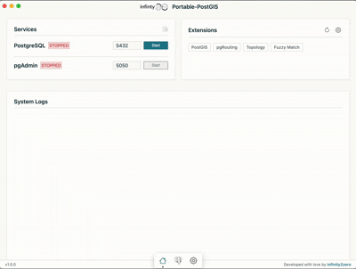

# Portable PostGIS App



A self-contained, portable application bundling PostgreSQL, PostGIS, and pgAdmin 4. This application allows you to run a spatial database environment without any complex installation or system-level dependencies.

## Default Connection Details
  
Use these details to connect to the database programmatically or via external tools:

| Parameter | Value |
|-----------|-------|
| **Host** | `localhost` |
| **Port** | `5432` |
| **User** | `postgres` |
| **Password** | `postgres` |
| **Database** | `postgres` |

## Features

- **Portable PostgreSQL**: Runs a local instance of PostgreSQL with PostGIS extensions pre-installed.
- **Embedded pgAdmin 4**: Includes a full-featured pgAdmin 4 interface for database management.
- **Zero Installation**: No system services or registry changes required.
- **Cross-Platform**: Designed for Windows and macOS.
- **User-Friendly Dashboard**: manage services, ports, and extensions from a simple UI.

## Getting Started

### Download

You can download the latest version of Portable PostGIS for Windows and macOS from the [Releases Page](https://github.com/infinity2zero/portable-postgis-app/releases).

### Installation

1.  Download the latest release for your operating system.
2.  Extract the archive (if zipped).
3.  Run the application executable (`Portable PostGIS.exe` on Windows or `Portable PostGIS.app` on macOS).

### macOS Troubleshooting ("App is damaged")

If you see an error saying **"Portable PostGIS.app is damaged and can't be opened. You should move it to the Trash"** when trying to launch on macOS, this is because the app is not code-signed with an Apple Developer Certificate.

To fix this, you need to remove the quarantine attribute from the app. Open your **Terminal** and run the following command:

```bash
xattr -cr /Applications/Portable\ PostGIS.app
```
*(Replace `/Applications/Portable\ PostGIS.app` with the actual path to where you placed the app)*

Alternatively, if you haven't moved it to Applications yet and it's in your Downloads folder:

```bash
xattr -cr ~/Downloads/Portable\ PostGIS.app
```

### Usage

1.  **Dashboard**: Upon launch, the dashboard shows the status of PostgreSQL and pgAdmin services.
2.  **Start Services**: Click "Start" next to PostgreSQL. Once running, you can start pgAdmin.
3.  **Access Database**: Switch to the "Database" tab to open the embedded pgAdmin interface.
    - **Default User**: `postgres`
    - **Default Password**: `postgres`
4.  **Settings**: Configure ports (default 5432 for Postgres, 5050 for pgAdmin) and manage extensions.

### Manually adding the server in pgAdmin (Windows & macOS)

In some builds, the default PostgreSQL server may not appear automatically in pgAdmin. You can add it manually:

1. **Open pgAdmin 4** from the app’s **Database** tab.
2. In the pgAdmin tree on the left, **right‑click** on `Servers` → **Create** → **Server...`.
3. In the **General** tab:
   - **Name**: `Portable Postgres` (or any name you like)
4. In the **Connection** tab:
   - **Host name/address**: `localhost`
   - **Port**: `5432` (or whatever you configured in the app settings)
   - **Maintenance database**: `postgres`
   - **Username**: `postgres`
   - **Password**: `postgres`
   - Optionally check **Save password?**
5. Click **Save**. The server should now appear under `Servers` and connect.

## Development

### Prerequisites

- Node.js (v16 or higher)
- npm or yarn

### Setup

1.  Clone the repository:
    ```bash
    git clone https://github.com/infinity2zero/portable-postgis-app.git
    cd portable-postgis-app
    ```

2.  Install dependencies:
    ```bash
    npm install
    ```

3.  **Resource Setup**: The application requires binary resources (PostgreSQL, pgAdmin, Python) to be placed in the `bin` directory.
    *   Run the setup script (if available) or manually place binaries in `bin/<platform>/`.
    *   Structure:
        *   `bin/win/postgres/`
        *   `bin/win/python/`
        *   `bin/mac/postgres/`
        *   `bin/mac/python/`

### Running Locally

```bash
npm start
```

## Building for Windows

To create a distributable Windows installer (NSIS) or portable executable:

1.  Ensure you have the Windows binaries in `bin/win/`.
2.  Run the build command:

```bash
npm run build -- --win
```

This will generate the installer in the `dist` directory.

### Configuration

The build configuration is managed in `package.json` under the `build` key.

- **appId**: `com.example.portable-postgis`
- **extraResources**: Bundles the `bin` and `data` directories into the application.

## Credits

- **Author**: [infinity2zero](https://github.com/infinity2zero)
- **PostgreSQL**: https://www.postgresql.org/
- **PostGIS**: https://postgis.net/
- **pgAdmin**: https://www.pgadmin.org/
